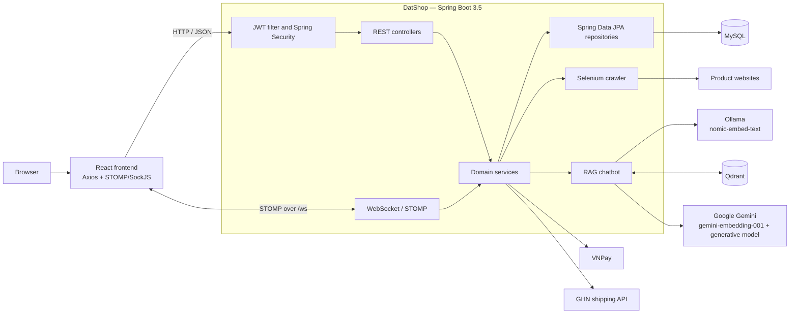

# DatShop Backend

DatShop is a Spring Boot backend for a social-commerce marketplace. It provides product and shop management, carts, orders, coupons, payments, delivery, follows and votes, real-time chat, product crawling, and a retrieval-augmented chatbot.

The repository also includes a responsive React frontend in `frontend/`, using Axios for the REST API and STOMP/SockJS for real-time messaging.

## Features

- JWT-based registration, login, refresh, and logout flows
- User and shop profiles
- Product CRUD, carts, coupons, orders, and bills
- VNPay payment URLs and payment callbacks
- GHN delivery creation, lookup, and cancellation
- Real-time one-to-one chat over WebSocket/STOMP
- Follow and vote interactions
- Selenium-based product crawling
- RAG chatbot using Gemini embeddings by default, with Ollama as a local embedding fallback, Qdrant vector search, and Gemini for responses
- OpenAPI documentation with Swagger UI

## Architecture



The application follows a feature-oriented structure. Each domain generally contains its own controller, service, repository, entity, DTO, and mapper packages.

## Technology stack

| Area | Technology |
| --- | --- |
| Runtime | Java 21 |
| Framework | Spring Boot 3.5.0 |
| API | Spring MVC, WebFlux `WebClient`, Bean Validation |
| Persistence | Spring Data JPA, Hibernate, MySQL |
| Security | Spring Security, JWT, BCrypt |
| Real-time messaging | Spring WebSocket, STOMP, SockJS |
| Mapping | MapStruct, Lombok |
| AI and vector search | Ollama, Google Gemini, Qdrant |
| Browser automation | Selenium, WebDriverManager |
| API documentation | springdoc-openapi / Swagger UI |
| Build and tests | Maven Wrapper, JUnit 5 |

## Prerequisites

- JDK 21
- MySQL
- Docker and Docker Compose, for Qdrant
- Ollama, only when using the local embedding fallback
- Google Chrome, when using the crawler
- A Gemini API key (required by the default embedding provider and the Gemini chatbot endpoint)
- VNPay and GHN credentials, when testing payment and delivery integrations

## Configuration

The shared configuration is in `src/main/resources/application.yaml`. It starts the server on port `8080`, selects a profile from `ACTIVE_PROFILE`, and lets Hibernate update the database schema.

Profile-specific configuration is stored in:

- `src/main/resources/application-dev.yaml`
- `src/main/resources/application-prod.yaml`

The production profile expects these environment variables:

| Variable | Purpose |
| --- | --- |
| `ACTIVE_PROFILE` | Active Spring profile, normally `dev` or `prod` |
| `DATABASE_URL` | MySQL JDBC URL |
| `DATABASE_USERNAME` | Database user |
| `DATABASE_PASSWORD` | Database password |
| `JWT_SECRET_KEY` | JWT signing secret |
| `JWT_EXPIRED_ACCESS` | Access-token lifetime |
| `JWT_EXPIRED_REFRESH` | Refresh-token lifetime |
| `VNP_TMN_CODE` | VNPay terminal code |
| `VNP_HASH_SECRET` | VNPay signing secret |
| `VNP_PAYMENT_URL` | VNPay payment endpoint |
| `VNP_RETURN_URL` | Application payment callback URL |
| `VNP_RESULT_URL` | VNPay transaction API URL |
| `GEMINI_API_KEY` | Google Gemini API key |
| `GEMINI_CHAT_MODEL` | Gemini chat model; defaults to `gemini-3.6-flash` |
| `GEMINI_THINKING_LEVEL` | Gemini reasoning effort; defaults to `minimal` |
| `AI_EMBEDDING_PROVIDER` | Embedding provider: `gemini` (default) or `ollama` |
| `AI_EMBEDDING_REINDEX_ON_STARTUP` | Rebuild the active Qdrant collection from MySQL on startup |
| `GEMINI_EMBEDDING_MODEL` | Gemini embedding model; defaults to `gemini-embedding-001` |
| `GEMINI_EMBEDDING_DIMENSION` | Gemini vector size; defaults to `768` |
| `GEMINI_QDRANT_COLLECTION` | Gemini Qdrant collection; defaults to `chatbot_rag_gemini` |
| `OLLAMA_QDRANT_COLLECTION` | Ollama Qdrant collection; defaults to `chatbot_rag` |

GHN and Gemini properties can also be supplied through Spring Boot's environment-variable binding:

| Variable | Spring property |
| --- | --- |
| `GHN_TOKEN` | `ghn.token` |
| `GHN_SHOP_ID` | `ghn.shopId` |
| `GHN_API_URL` | `ghn.apiUrl` |
| `GEMINI_API_KEY` | `GOOGLE.gemini-api-key` in the production profile |

> `local.env` is ignored by Git and is not loaded automatically by Spring Boot. Export its values in your shell, configure them in your IDE, or use a dotenv integration. Never commit real credentials.

### PowerShell example

```powershell
$env:ACTIVE_PROFILE = "dev"
$env:GEMINI_API_KEY = "your-api-key"
```

For production, set the variables listed above in the deployment environment instead of storing secrets in YAML files.

## Run locally

1. Start MySQL and create the database referenced by the selected profile.

2. Start Qdrant:

   ```powershell
   docker compose up -d qdrant
   ```

   Qdrant is exposed on ports `6333` (REST) and `6334` (gRPC), with data persisted in the `qdrant_data` volume.

3. Gemini is the default embedding provider. Set its API key before starting the application:

   ```powershell
   $env:GEMINI_API_KEY = "your-api-key"
   ```

   Ollama remains available as an optional local embedding fallback:

   ```powershell
   ollama pull nomic-embed-text
   ollama serve
   ```

4. Set the active profile and required credentials, then start the application:

   ```powershell
   $env:ACTIVE_PROFILE = "dev"
   .\mvnw.cmd spring-boot:run
   ```

On macOS or Linux, use `./mvnw spring-boot:run` and your shell's `export` syntax for environment variables.

The API is available at `http://localhost:8080`.

### Start the frontend

With Node.js 20.19 or newer and pnpm installed:

```powershell
Set-Location frontend
Copy-Item .env.example .env
pnpm install
pnpm dev
```

Open `http://localhost:5173`. The frontend reads the backend address from `VITE_API_URL`, which defaults to `http://localhost:8080`.

## API documentation

With the application running:

- Swagger UI: `http://localhost:8080/swagger-ui.html`
- OpenAPI JSON: `http://localhost:8080/v3/api-docs`

Main endpoint groups:

| Base path | Responsibility |
| --- | --- |
| `/api/v1/auth` | Register, login, logout, and token refresh |
| `/api/v1/user` | User profiles |
| `/api/v1/user/product` | Products |
| `/api/v1/user/cart` | Shopping cart |
| `/api/v1/user/order` | Customer and shop orders |
| `/api/v1/coupon` | Coupons |
| `/api/v1/user/follow` | Follows |
| `/api/v1/user/vote` | Votes |
| `/api/v1/chat/rooms` | Chat conversations |
| `/api/v1/chatbot` | Gemini chatbot queries |
| `/api/v1/information` | RAG knowledge ingestion |
| `/api/v1/crawl` | Product crawling |
| `/api/v1/shop/delivery` | GHN delivery operations |
| `/api/v1/callback` | Payment callbacks |

Endpoints that use the current user expect a JWT access token:

```http
Authorization: Bearer <access-token>
```

## WebSocket chat

- Handshake endpoint: `/ws`
- Application destination prefix: `/app`
- Send messages to: `/app/chat/{conversationId}`
- Broker destinations: `/topic/**` and `/queue/**`
- SockJS fallback is available on `/ws`

## Chatbot flow

The chatbot embeds documents and questions with the selected provider, searches its dedicated Qdrant collection for the five closest records, and sends that context to Gemini. Gemini `gemini-embedding-001` is selected by default and stores 768-dimensional vectors in `chatbot_rag_gemini`. The original Ollama `nomic-embed-text` embedding integration remains available and continues to use `chatbot_rag`, so the two incompatible vector spaces are never mixed.

Before querying the chatbot, add knowledge through `POST /api/v1/information/create` so that its text and embedding are stored in MySQL and Qdrant.

### Select the embedding provider

Use Gemini (the default):

```powershell
$env:GEMINI_API_KEY = "your-api-key"
$env:AI_EMBEDDING_PROVIDER = "gemini" # optional because this is the default
```

Switch back to the original local Ollama model:

```powershell
$env:AI_EMBEDDING_PROVIDER = "ollama"
```

### Rebuild vectors after changing providers

Existing MySQL information records need embeddings in the new provider's Qdrant collection. Enable the startup reindex for one run:

```powershell
$env:AI_EMBEDDING_PROVIDER = "gemini"
$env:AI_EMBEDDING_REINDEX_ON_STARTUP = "true"
.\mvnw.cmd spring-boot:run
```

After the log confirms that reindexing completed, stop the application and unset the flag so Gemini is not called again on every startup:

```powershell
Remove-Item Env:AI_EMBEDDING_REINDEX_ON_STARTUP
```

Qdrant creates the selected collection automatically on its first insert or query. Switching to Ollama later reuses the original `chatbot_rag` collection and its existing vectors.

## Tests and build

Run the test suite:

```powershell
.\mvnw.cmd test
```

Create an executable JAR:

```powershell
.\mvnw.cmd clean package
```

Run the packaged application:

```powershell
java -jar target/DatShop-0.0.1-SNAPSHOT.jar
```

Some integration-style tests and features require their external services and credentials to be available.

## Project structure

```text
src/
├── main/
│   ├── java/com/dat/backend/datshop/
│   │   ├── authentication/  # JWT and security
│   │   ├── cart/            # Cart and cart items
│   │   ├── chat/            # STOMP messaging and conversations
│   │   ├── chatbot/         # Ollama, Gemini, and Qdrant RAG
│   │   ├── coupon/          # Coupon management
│   │   ├── crawl/           # Selenium crawler
│   │   ├── delivery/        # GHN integration
│   │   ├── follow/          # Follow relationships
│   │   ├── order/           # Orders, bills, and VNPay
│   │   ├── product/         # Product catalog
│   │   ├── user/            # Users and profiles
│   │   └── vote/            # Voting interactions
│   └── resources/           # Shared and profile configuration
└── test/                    # Spring and unit tests
```

## Development notes

- `spring.jpa.hibernate.ddl-auto` is currently `update`; use managed migrations such as Flyway or Liquibase before relying on this project in production.
- The current security configuration permits all HTTP requests, although JWT processing and authenticated-user flows are implemented. Tighten route authorization before production deployment.
- CORS currently accepts every origin. Replace the wildcard with trusted frontend origins in production.
- Qdrant and Ollama addresses are currently fixed to localhost in the service code.
